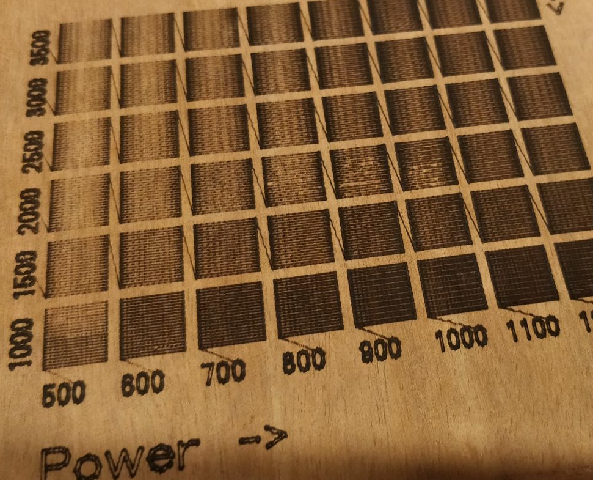

# Swatch generator for laser etchers

Generates a series of paths at different feedrates / laser power, to check the effect of your CNC laser etcher on different materials.

# Reference
 - Font (public domain): http://www.fontspace.com/micronus/y145m-2009
 - https://github.com/nodebox/opentype.js
 - http://linuxcnc.org/docs/html/gcode/m-code.html#mcode:m3-m4-m5
